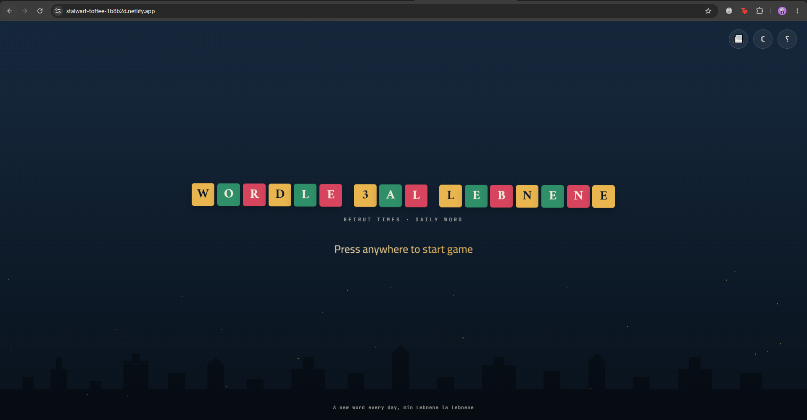
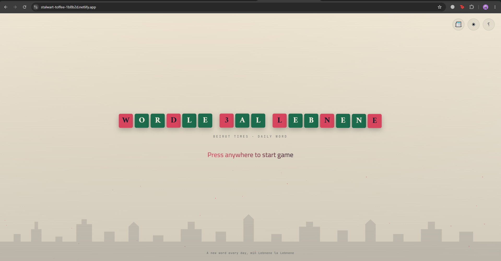
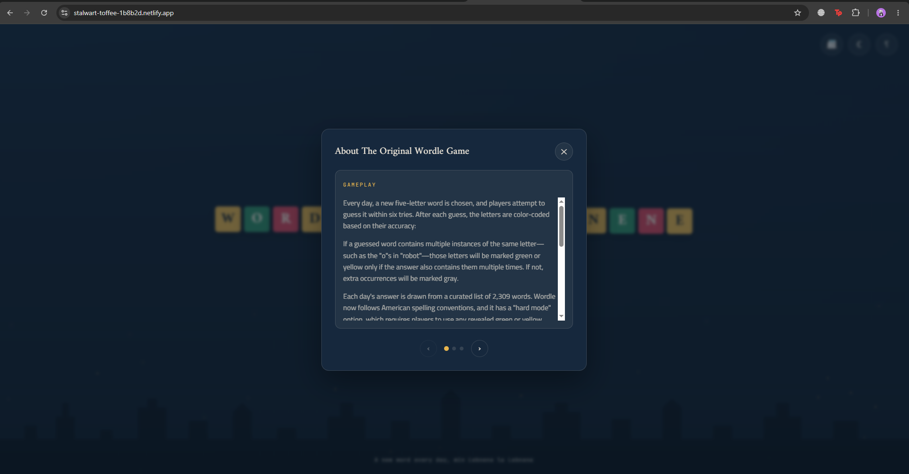
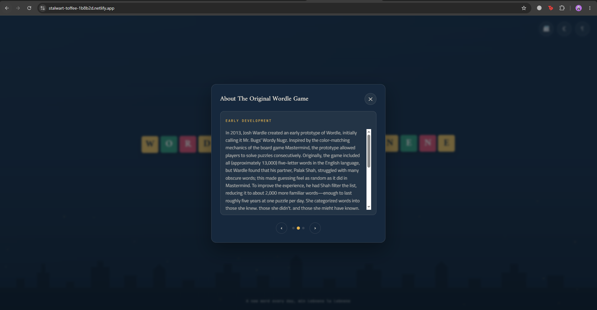
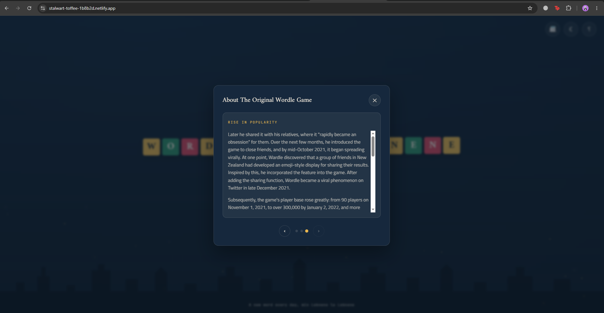
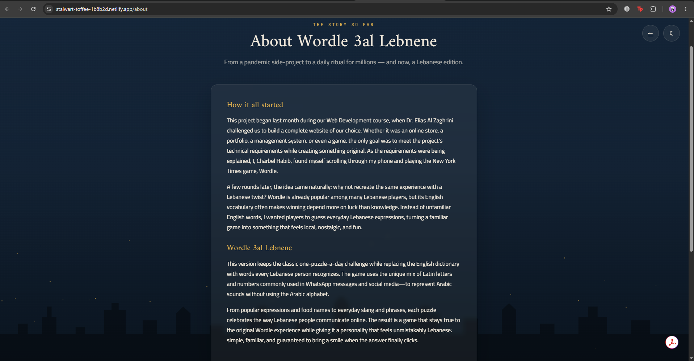
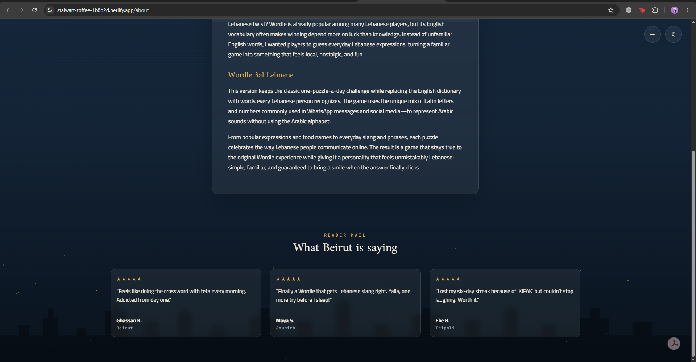
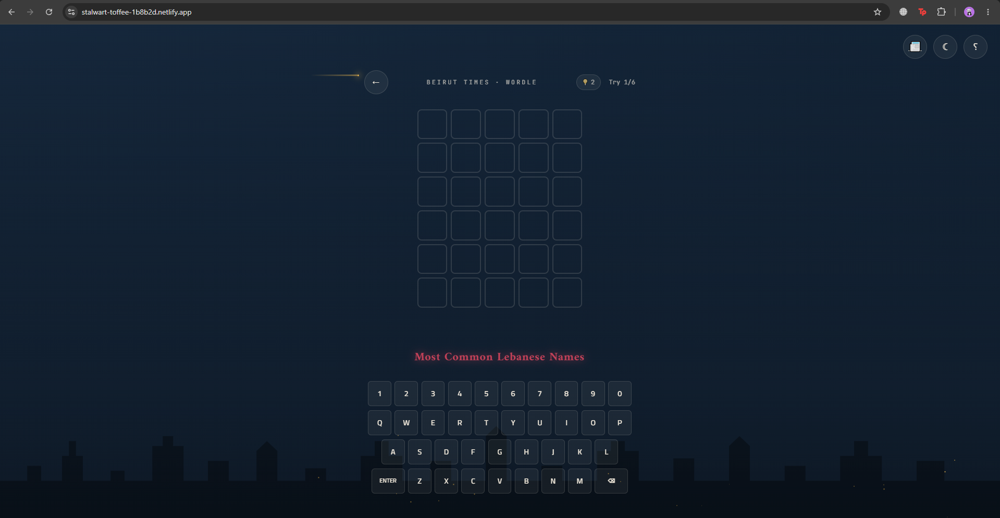

# 3al Lebnene — Beirut Times

A Wordle-style daily word game built around Lebanese Arabizi vocabulary.

**Live demo:** [stalwart-toffee-1b8b2d.netlify.app](https://stalwart-toffee-1b8b2d.netlify.app)
**Repository:** [github.com/Charbel-Habib/Wordle-3al-Lebnene](https://github.com/Charbel-Habib/Wordle-3al-Lebnene)

## a. Author

Charbel Habib

## b. API used

**Wikipedia Action API** (`https://en.wikipedia.org/w/api.php`, `action=parse`) — the "؟" info modal on the main menu fetches sections 1, 3 and 4 of the live [Wordle Wikipedia article](https://en.wikipedia.org/wiki/Wordle) (Gameplay, Rise in popularity, Early development) straight from Wikipedia at runtime. The raw HTML response is parsed client-side with `DOMParser`, stripped of edit-section links, citation markers, tables and references, and rendered as a paginated 3-page card (`WikipediaSectionLoader` / `InfoModal` in [js/main.js](js/main.js)), with loading and error states for when the request fails.

## c. Description

3al Lebnene is a Wordle clone that replaces the English dictionary with everyday Lebanese Arabizi words (the mix of Latin letters and numbers Lebanese people use to type Arabic on WhatsApp/social media). It keeps the classic one-puzzle-a-day, 6-try format, but adds its own identity on top:

- Animated night-sky main menu (drifting gradient, sparkle particles, skyline silhouette) with a Wordle-tile title that flips in on load.
- Dark/light theme toggle, persisted in `localStorage`.
- A full game screen with an on-screen keyboard, a hint system (reveal a letter at the cost of a try), and random ambient "weather" events (rain/snow/thunder/meteor) plus a power-outage hazard that temporarily disables the keyboard.
- A win/lose result modal with stats, and a dedicated About & Testimonials page.

## d. Custom requirement

My chosen custom requirement was a **testimonials section styled with Bootstrap cards**. On [about.html](about.html) there's a "What Beirut is saying" section built with Bootstrap's grid (`row g-4`) and `card` components, laid out responsively (1 column on mobile, up to 3 per row on desktop). Each card is a static, curated fake reader quote (name, city, star rating) written to match the game's Beirut Times/newspaper theme, reusing the same `ThemeManager`/`SparkleField` classes as the main menu so the page stays visually consistent without duplicating the game bootstrap logic.

## Structure

```
index.html         Main menu (topbar, animated hero, game screen, info/result modals)
about.html          About Wordle + testimonials (Bootstrap cards)
css/style.css        Hand-written CSS3 (design tokens, animations, responsive rules)
js/main.js           ES6 classes: ThemeManager, SparkleField, TileTitle, StartTrigger,
                      WikipediaSectionLoader, InfoModal, game board/keyboard/weather logic
js/about.js          ThemeManager + SparkleField for the About page
Screenshots/         Evidence screenshots (see below)
```

## Screenshots

| | |
|---|---|
|  |  |
|  |  |
|  |  |
|  |  |

1–2. Home page and the "؟" info modal opening.
3–4. Info modal pages (Rise in popularity, Early development) sourced live from the Wikipedia API.
5–6. About page and the Bootstrap-card testimonials section (custom requirement).
7–8. The game itself, played from the inside.

## e. AI-use appendix

**Tools used:** GitHub Copilot Chat in VS Code, using the Claude Sonnet models (mainly Claude Sonnet 4 / 4.5, and Claude Sonnet 5 for this README/deployment pass).

**Example prompts used during the project:**
- "Build the main menu with an animated night-sky backdrop, a Wordle-tile title that flips in, and a dark/light theme toggle saved to localStorage."
- "Add an info modal with loading/error states and a paginated Gameplay/History/Description view."
- "Wire the info modal up to a real API instead of mock data — pull the Wordle history/gameplay text from Wikipedia."
- "Add a weather system and a power-outage hazard that disables the keyboard mid-game."
- "Add a testimonials section on the about page using Bootstrap cards."
- "Prepare the README for submission: name, API used, description, custom requirement, AI-use appendix."

**What the AI got wrong (and had to be fixed):**
- The info modal was first built against **mock/hard-coded text** for Gameplay/History/Description; it needed a follow-up pass to actually call the Wikipedia API and parse real HTML instead of returning canned strings.
- The first version of `WikipediaSectionLoader` returned raw Wikipedia HTML (including edit-section links, `[citation needed]`-style markers, and a references table) straight into the DOM — it had to be corrected to strip `.mw-editsection`, `sup.reference`, `.mw-references-wrap`, `style`/`link` tags and `table`s before rendering, otherwise the modal showed broken markup and stray "[edit]" links.
- The theme toggle initially only updated `localStorage` without re-applying the `data-theme` attribute on load, causing a flash of the wrong theme on page refresh until the `apply()` step was added to the constructor.
- Copilot suggested calling the Wikipedia API without `origin=*` and `format=json`, which fails from the browser due to CORS — this had to be added manually to the request URL.
- During this documentation pass, a couple of tool calls (an early terminal `git remote` check, and a first draft of clarifying questions) failed or were unnecessary since the repository lives under a different GitHub account than the local git config — these were corrected by asking directly instead of relying on local git metadata.
